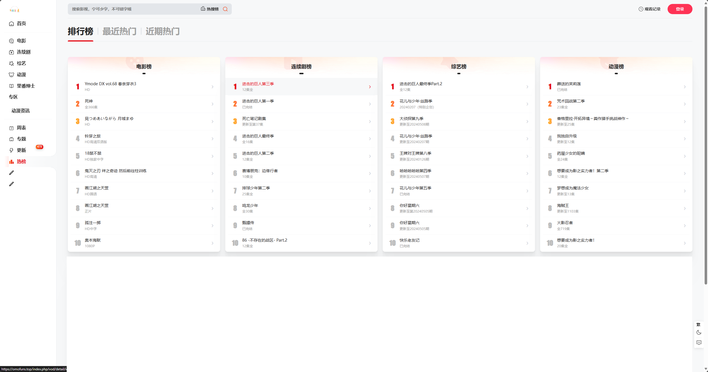

# 前期规划文档

## UI 设计

> ### **==首页==**

观察了一些电影/动漫/视频播放软件, 发现布局大部分一样, 在这里贴一些我看到的主流/不主流的一些播放网页 UI

于是决定使用类似的设计

1. 左侧使用标签分栏, 用于展示不同的页面, 结合课程体系要求, 分为以下几个部分 :

   > 1. 首页, 用于展示基本的本体:
   > 2. 播放数据分析 : 课程报告要求使用 Echart 展示图表, 所以在这一个模块用来展示图表
   > 3. 排行表, 在这个部分展示相关的排行 // 可打印

2. 上测展示一些热门视频的截图[如上例所展示]
3. 下册则展示一些资源

> ### **==排行==**

按照大作业要求, 排行分为以下几个部分: **本周排行，本月排行，全部排行，按好评排行**

## 用户操作逻辑

> 普通操作

当用户打开本网站的时候, 将会展示首页的内容, 用户可以自由在 首页/播放数据分析/排行榜 中自由切换

如果用户点击任意页面准备进入播放页面的时候, 如果处于未登录状态, 那么将不能进行登录, 除非进行登录

登录完成后即可正常使用网页全部功能

> 登录操作

用户可以以两种方式弹出登录弹窗

> 1. 当未登录进入播放页面的时候
> 2. 主动点击头像进入登录页面

登录/注册的表单使用 ElEment 来实现

> 搜索功能

可以更具主演/导演/名称/标签 等进行搜索

> 支付功能

支付宝沙盒支付 // 单纯应付大作业要求, 后期会直接删除

**可选的功能**

> 弹幕功能

> 评论/打分功能

> 反馈功能

